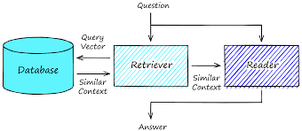

# Question Answering

## About

A `retriever`-`reader` architecture for `Question`-`Answering` pipeline where:
- `retriever`: Responsible for retrieving relevant documents for a given query, both in `Dense` or `Sparse` format.
- `reader`: Responsible for extracting an answer from the documents provided by the retriever. The `reader` can be extractive (extract answer from relevant retrieved documents) or generative (generate free-form answers, i.e RAG).

## The reader's backbone
The reader's backbone is the [MiniLM](https://arxiv.org/abs/2002.10957), a distilled version of BERT-base that preserves 99% of the performance 66M 79.5 while being twice as fast.

We use MiniLM model pre-trained on [SQuAD 2.0](https://huggingface.co/datasets/squad_v2) dataset, as it should help when working on Question-Answering downstream task.

## The dataset
We then fine-tune the reader's backbone on [SubjQA](https://huggingface.co/datasets/subjqa) dataset.

## Evaluation
- Evaluate the performance of `Dense` and `Sparse` version of the retriever.
- Evaluate the performance of the reader with/without fine-tuning on downstream task dataset.
- Evaluate the performance of the whole pipeline.

## Run
- See [INSTALL.md](INSTALL.md) to install dependencies and setup elasticsearch.
- run `python src/train.py` to train the reader's backbone.
- run the [analysis notebook](src/analysis.Rmd) notebook to play with the Question-Answering pipeline.
